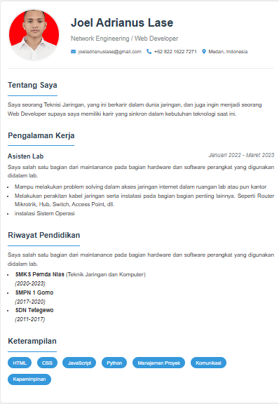

# 📄 CV Digital - Joel Adrianus Lase

  
*Tampilan CV Digital Responsif*

## 🌟 Deskripsi Proyek
CV digital interaktif yang menampilkan:
- Profil profesional di bidang jaringan komputer dan pengembangan web
- Riwayat pekerjaan sebagai Asisten Lab dengan tugas spesifik
- Pendidikan formal dari SMK hingga SD
- 7+ keterampilan teknis dan soft skills
- Sistem kontak visual dengan Font Awesome v6

## 🛠 Stack Teknologi
| Komponen       | Teknologi                         | Implementasi Spesifik              |
|----------------|-----------------------------------|------------------------------------|
| Frontend       | HTML5                            | Semantic HTML structure            |
|                | CSS3                             | Flexbox, Media Queries             |
| Utilities      | Font Awesome 6                   | Ikon kontak (email, phone, map)    |
| Design         | Mobile-first                     | Breakpoint 768px                   |

## 🎨 Fitur Utama
✅ **Desain Responsif**  
   - Optimal di mobile (flex-direction: column)  
   - Tampilan desktop yang elegan  

✅ **UX Enhancements**  
   - Border-radius 50% untuk foto profil  
   - Box-shadow untuk depth visual  

✅ **Organisasi Konten**  
   - Section terpisah dengan border-bottom  
   - Hierarki typography yang jelas  

## 📂 Struktur File
```bash
joel/
├── index.html            # Main CV document
├── styles.css            # Custom styling (358 lines)
├── assets/
│   └── foto-profile.jpg  # Profile picture (150x150px)
└── README.md            # This documentation

## 🚀 Cara Menjalankan

### **Metode 1: Local Preview**
```bash
# Clone repository
git clone https://github.com/username/repo.git

# Masuk ke folder project
cd repo/joel

# Buka file (tergantung OS)
start index.html  # Untuk Windows
open index.html   # Untuk macOS
xdg-open index.html  # Untuk Linux

